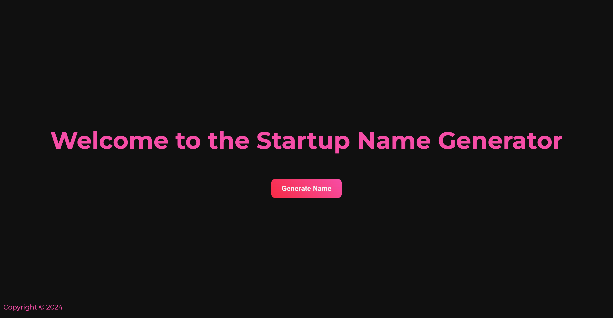
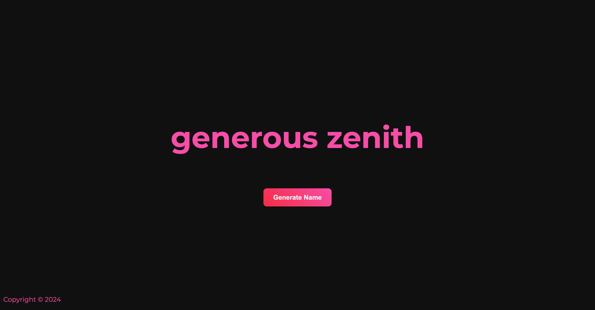

# **Startup Name Generator**

A web-based application built with **Node.js**, **Express**, **EJS**, and **CSS3**, designed to generate unique and quirky startup names randomly. Perfect for entrepreneurs looking for inspiration or anyone in need of a fun name for their next big idea!

---

## **Features**

- **Random Startup Name Generation**: Get unique and creative names with a single click.
- **Interactive UI**: A clean, modern design for an enjoyable user experience.
- **Responsive Design**: Optimized for both desktop and mobile devices.
- **Reusable Components**: Includes modular EJS templates for easy customization.
- **Lightweight and Fast**: Built with simplicity and speed in mind.

---

## **Technologies Used**

- **Backend**: [Node.js](https://nodejs.org/) + [Express.js](https://expressjs.com/)
- **Templating Engine**: [EJS](https://ejs.co/)
- **Styling**: CSS3
- **Frontend**: HTML5 + JavaScript

---

## **Installation**

1. **Clone the Repository**:
   ```bash
   git clone https://github.com/<your-username>/<repo-name>.git
   cd <repo-name>
   ```

2. **Install Dependencies**:
   - Initialize your Node.js project (if not already initialized):
     ```bash
     npm init -y
     ```
   - Install **Express** and **EJS**:
     ```bash
     npm install express ejs
     ```

3. **Run the Application**:
   ```bash
   npm start
   ```

4. **Open in Browser**:
   - Visit `http://localhost:3000` to view the app.

---

## **How It Works**

1. Open the application in your browser.
2. Click the "Generate" button to receive a unique startup name.
3. Refresh or click again for more names!
4. Optionally, customize the app by tweaking the code for your personalized name patterns.

---

## **File Structure**

```
.
├── public/
│   ├── style/
│   │   └── main.css        # CSS styles
├── views/
│   ├── index.ejs           # Main template
│   ├── partials/
│   │   ├── header.ejs      # Header component
│   │   └── footer.ejs      # Footer component
├── app.js                  # Main application file
├── package.json            # Dependencies and scripts
└── README.md               # Documentation
```

---

## **Screenshots**

### Home Page


### Random Name Generation


---

## **Contributions**

Contributions are welcome! Feel free to fork the repo, create a new branch, and submit a pull request with your improvements.

---

## **License**

This project is licensed under the [MIT License](LICENSE).

---

## **Contact**

For questions or suggestions, feel free to reach out:

- **GitHub**: [@Aaaly123](https://github.com/Aaaly123)
- **Email**: your.email@example.com

---

Feel free to update placeholders such as `<your-username>` and `<repo-name>` with your actual GitHub details and project name. Let me know if you need further edits!
